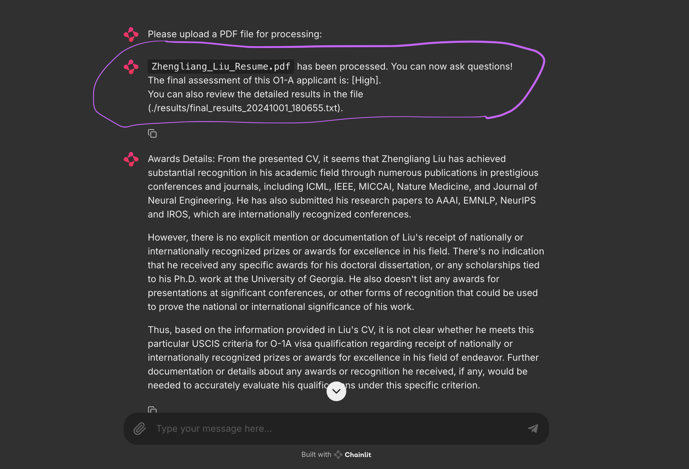
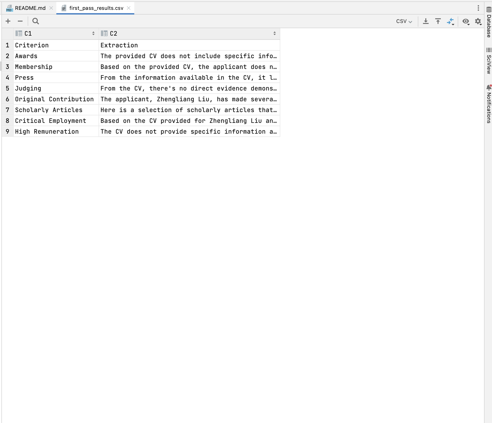
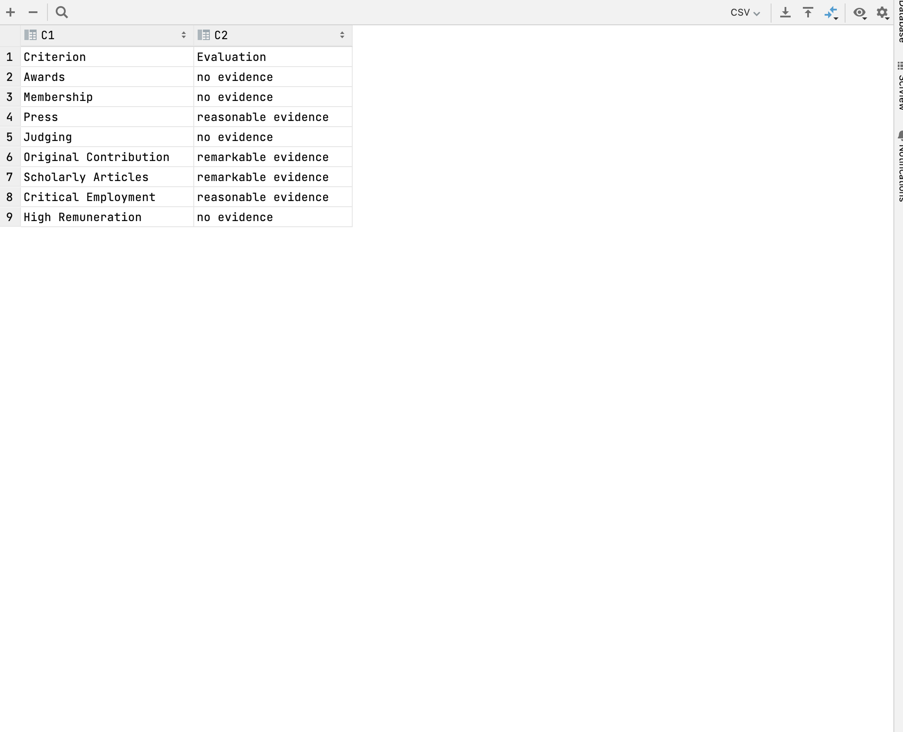
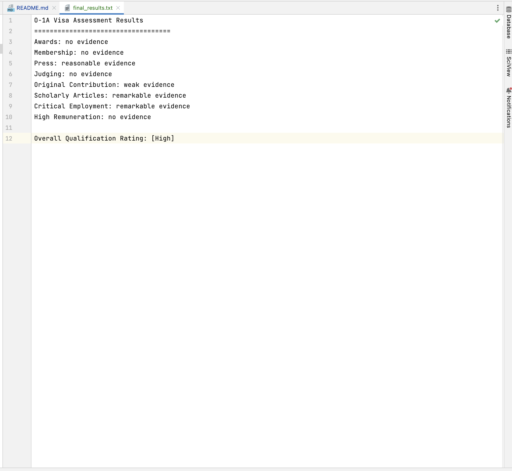
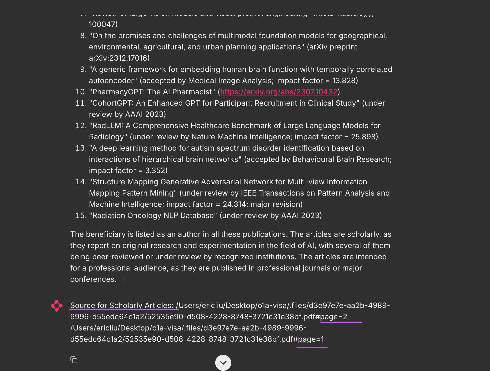

# O-1A Visa Application Evaluator

This project is an automated tool that evaluates an applicant's likelihood of success for an O-1A visa based on their CV. The application processes a resume/CV PDF file, assesses the evidence based on O-1A criteria, and outputs a final rating of [Low], [Medium], or [High].

## Screenshots







## Documentation

For detailed information about the design choices and evaluation process, please refer to [O-1A Visa System Design](o1a-visa-system-design.md) document.

## Installation

1. Clone the app repository:
   ```bash
   git clone https://github.com/zl-liu/o1a-visa-app.git
   cd o1a-visa-app
   ```

2. Create the Conda environment from the environment.yml file:
   ```bash
   conda env create -f environment.yml
   ```

3. Activate the Conda environment:
   ```bash
   conda activate myenv
   ```

## Starting the Application

1. Run the FastAPI server:
   In the first terminal, run the following command to start the FastAPI server:
   ```bash
   uvicorn main:app --host 0.0.0.0 --port 8000 --reload
   ```
   This will launch the backend server, which processes the uploaded PDF files.

2. Run the Chainlit frontend:
   In a separate terminal, start the Chainlit frontend:
   ```bash
   chainlit run my_cl_app.py --host 0.0.0.0 --port 8500
   ```
   This will launch the web interface for uploading the resume/CV PDF file and receiving the assessment.

## Usage

There are two ways to use the O-1A Visa Qualification System:

### 1. Using the Chainlit Web Interface

1. Open your browser and go to the Chainlit app at:

   ```
   http://0.0.0.0:8500
   ```

2. Upload a resume/CV PDF file when prompted.

3. Wait for the system to process the file.

4. After processing, the system will output the likelihood of success for the O-1A visa application as either [Low], [Medium], or [High].

### 2. Directly Hitting the API Endpoint

Alternatively, you can interact with the system directly through its API endpoint. Here's an example using curl:

```bash
curl -X 'POST' \
  'http://127.0.0.1:8000/assess_o1a/' \
  -H 'accept: application/json' \
  -H 'Content-Type: multipart/form-data' \
  -F 'file=@Zhengliang_Liu_Resume.pdf'
```

Replace `Zhengliang_Liu_Resume.pdf` with the path to your PDF file.

Please note you can also use other programming languages to query this API endpoint.

#### API Response

The API will return a JSON object with the following structure:

```json
{
  "extractions": {...},
  "evaluations": {...},
  "final_rating": "..."
}
```

- `extractions`: Contains the extracted information for each of the eight O-1A criteria.
- `evaluations`: Contains the evaluation results for each criterion.
- `final_rating`: The overall qualification rating ([Low], [Medium], or [High]).

You can parse this JSON response to get the `final_rating` or any other specific information you need.

## License
